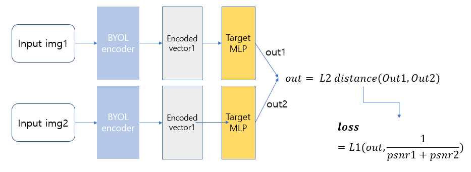

# PyTorch-BYOL
### PyTorch implementation of [Bootstrap Your Own Latent: A New Approach to Self-Supervised Learning](https://arxiv.org/abs/2006.07733).


## Installation and run BYOL training

Clone the repository and run
```
$ conda env create --name byol --file env.yml
$ conda activate byol
$ python main.py
```

## Config

Before running PyTorch BYOL, make sure you choose the correct running configurations on the config.yaml file.

```yaml
network:
  name: resnet18 # base encoder. choose one of resnet18 or resnet50
   
  # Specify a folder containing a pre-trained model to fine-tune. If training from scratch, pass None.
  fine_tune_from: 'resnet-18_40-epochs'
   
  # configurations for the projection and prediction heads
  projection_head: 
    mlp_hidden_size: 512 # Original implementation uses 4096
    projection_size: 128 # Original implementation uses 256

data_transforms:
  s: 1
  input_shape: (96,96,3)

trainer:
  batch_size: 64 # Original implementation uses 4096
  m: 0.996 # momentum update
  checkpoint_interval: 5000
  max_epochs: 80 # Original implementation uses 1000
  num_workers: 4 # number of worker for the data loader

optimizer:
  params:
    lr: 0.03
    momentum: 0.9
    weight_decay: 0.0004
```

## Feature Evaluation

We measure the quality of the learned representations by linear separability.

During training, BYOL learns features using the STL10 ```train+unsupervised``` set and evaluates in the held-out ```test``` set.

|       Linear Classifier      | Feature  Extractor | Architecture | Feature dim | Projection Head  dim | Epochs | Batch  Size | STL10 Top 1 |
|:----------------------------:|:------------------:|:------------:|:-----------:|:--------------------:|:------:|:-----------:|:-----------:|
|      Logistic Regression     |    PCA Features    |       -      |     256     |           -          |    -   |             |    36.0%    |
|              KNN             |    PCA Features    |       -      |     256     |           -          |    -   |             |    31.8%    |
| Logistic Regression  (Adam) |     BYOL (SGD)     |   [ResNet-18](https://drive.google.com/file/d/1Qj01H8cox8067cpCwhHZSQ0nfQl2RHbQ/view?usp=sharing)  |     512     |          128         |   40   | 64          |    70.1%    |
| Logistic Regression  (Adam) |     BYOL (SGD)     |   [ResNet-18](https://drive.google.com/file/d/1CFQZWKfBzAZp56EADYfMgq0HHua3XCQW/view?usp=sharing)  |     512     |          128         |   80   | 64          |    75.2%    |


---
# Latent Vector MLP with BYOL encoder
### Latent Vector extraction with BYOL encoder.

## Executing

make tensor data and train
```
# <Generate tensors and train MLP>
# 1. (generate 1*512 vectors and save them in local => be able to avoid lack of GPU memory)
$ cd eval/
# run save_feature_tensorV2.ipynb in ./eval/
# 2. training (example, check the run_load_and_train.sh in eval/)
$ python load_and_tran.py

# <feature vector extraction(check the parameters in files) >
$ cd ./latent_eval
# 1. (generate 1*512 vectors and save them in local => be able to avoid lack of GPU memory)
$ cd eval/
# run save_feature_tensorV2.ipynb in ./eval/
# 2. extract features
$ python generate_latent_out.py
```


